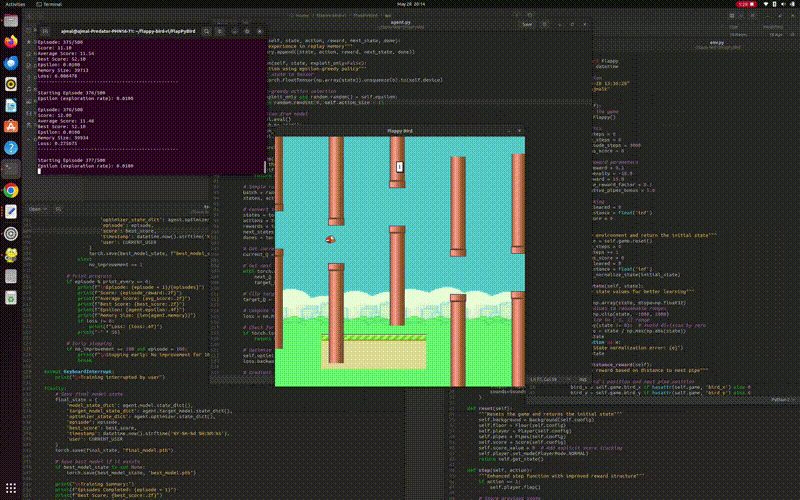

# FlapPyBird Reinforcement Learning
A Flappy Bird Clone with Deep Q-Learning implementation using PyTorch and Pygame

Last Updated: 2025-05-29 10:31:09 UTC  
Author: MhdAjmalk

## Overview
This project extends the original [FlapPyBird](https://sourabhv.github.io/FlapPyBird) game by implementing a Deep Q-Learning agent that learns to play the game. The agent uses a neural network to determine optimal actions based on the game state.

## Demo
### Training Progress


*Training Process: Watch the agent learn from random movements to skillful navigation*

<details>
<summary>Alternative Video Format (WebM)</summary>

You can also [download the WebM video](assets/gifs/trimmed_video.webm) for better quality.

</details>

## Features
- Deep Q-Learning implementation with PyTorch
- Real-time visualization of training process
- Continuous learning capability with model saving/loading
- Performance metrics tracking:
  - Episode scores
  - Average score
  - Best score (Current best: 100+)
  - Epsilon value (exploration rate)
  - Memory size
  - Loss values

## Performance Highlights from Demo
- Starting episodes: Random actions, quick failures
- Mid training (~100 episodes): Learning basic navigation
- Later episodes (~200+): Successfully avoiding pipes
- Best performance: Score 100+ achieved
- Training duration: ~1-2 hours for good performance

## Setup
1. Install Python 3.10 or later
2. Create and activate a virtual environment:
```bash
python -m venv venv
source venv/bin/activate  # On Windows: venv\Scripts\activate
```

3. Install required packages:
```bash
pip install torch pygame numpy
```

4. Clone the repository:
```bash
git clone <your-repo-url>
cd FlapPyBird
```

## Usage

### Training the Agent
```bash
python train.py
```

Controls during training:
- `Ctrl+C`: Safely stop training and save the model
- Close window: Exit the game

### Training Parameters
The agent's behavior can be customized by modifying these parameters in `agent.py`:
```python
# Key parameters and their default values
learning_rate = 0.001
gamma = 0.99        # Discount factor
epsilon = 1.0       # Initial exploration rate
epsilon_min = 0.01  # Minimum exploration rate
memory_size = 50000 # Replay memory size
batch_size = 64     # Training batch size
```

### Model Persistence
- Best performing models are automatically saved
- Training can be resumed from previous sessions
- Multiple model checkpoints are maintained

## Project Structure
```
FlapPyBird/
│
├── train.py          # Main training loop and visualization
├── agent.py          # DQN agent implementation
├── env.py            # Game environment wrapper
├── flappy.py         # Original game implementation
│
├── assets/           # Game assets
│   ├── sprites/      # Game sprites
│   └── media/        # Documentation media files
│
└── models/           # Saved model checkpoints
    ├── best_model_latest.pth     # Latest best performing model
    └── best_model_score_*.pth    # Historical best models
```

## Performance Metrics
From the demo video, you can observe:
- Initial random behavior
- Gradual learning of basic movements
- Development of pipe avoidance strategy
- Achievement of consistent high scores

## Requirements
- Python 3.10+
- PyTorch
- Pygame
- NumPy

## Acknowledgments
- Original FlapPyBird game by [sourabhv](https://github.com/sourabhv/FlapPyBird)
- Modified and extended for reinforcement learning by [MhdAjmalk](https://github.com/MhdAjmalk)

## License
This project is licensed under MIT License - see the LICENSE file for details.

## Contributing
Feel free to submit issues, fork the repository, and create pull requests for any improvements.
